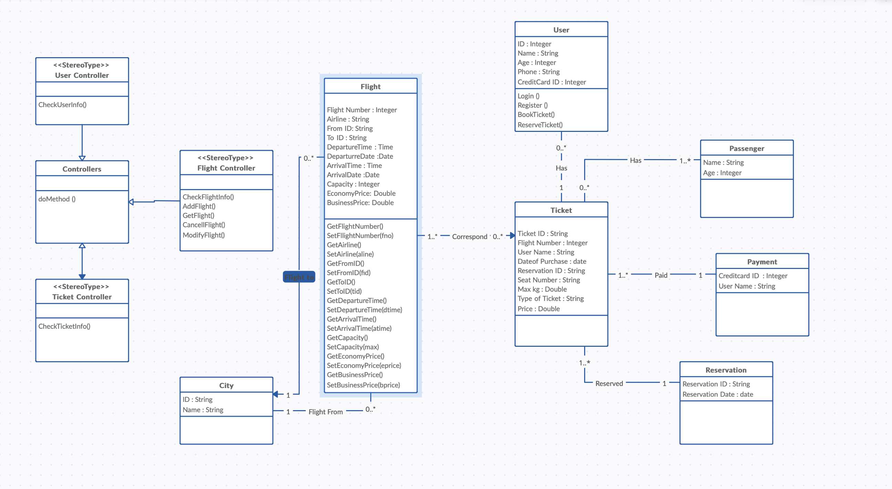

# Architecture and Design

**Value Objects and Entities:**

- **Value Objects:**
    - City: Represents a city with immutable properties (ID and name).
    - Address: Represents an address with immutable properties (street, city, state, zip).
    - CreditCard: Represents a credit card with immutable properties (number, expiration date, CVV).
    - Ticket: Represents a ticket with immutable properties (ticket ID, flight number, user name, date of purchase, reservation ID, seat number, type of ticket, price, and maximum baggage weight).
- **Entities:**
    - User: Represents a user with mutable properties (ID, name, age, phone number, credit card information).
    - Flight: Represents a flight with mutable properties (flight number, airline, origin city, destination city, departure time, arrival time, departure date, arrival date, capacity, economy price, and business price).
    - Reservation: Represents a reservation with mutable properties (reservation ID and reservation date).
    - Payment: Represents a payment with mutable properties (credit card ID and user name).

