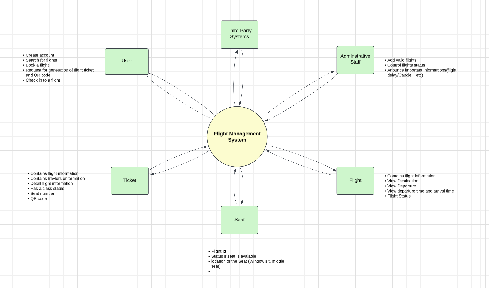
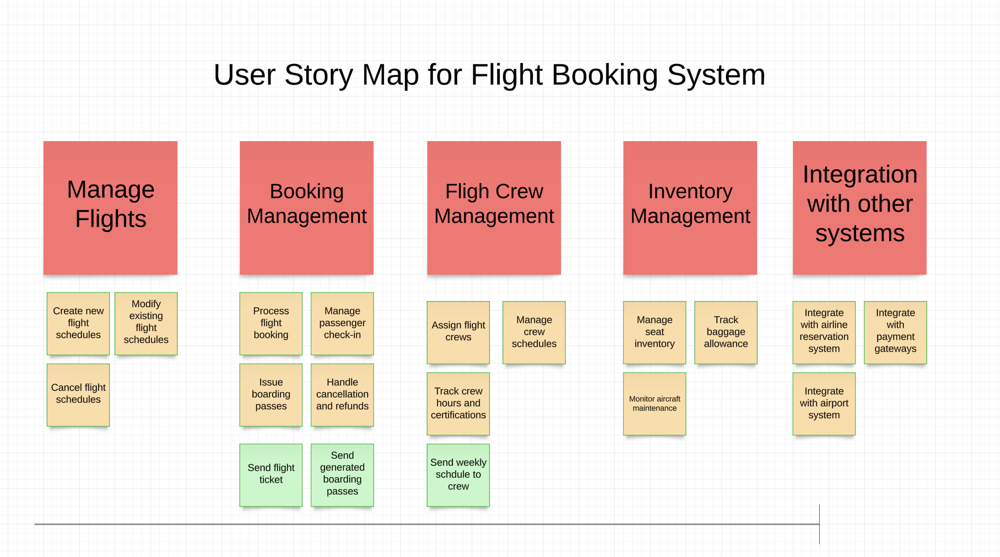

# Requirements

**Team Members**
1. [Abraham Mathewos Meja](https://github.com/abraham-tech)
2. [Leul W. Tewolde](https://github.com/leultewolde)
3. [Msgun](https://github.com/Msgun95)

## Project Context Diagram

## Use Case Diagram

## User Story Map

## Acceptance Criteria and Scenarios
### 1. **Booking Management: Process Flight Booking**

**Acceptance Criteria:**

- A passenger can select a flight from the available flight schedule.
- The system verifies seat availability before proceeding with booking.
- A successful booking generates a ticket with a unique ID, traveler details, and flight information.
- The system notifies the passenger about successful booking and sends the ticket to their email.

**Scenarios:**

1. **Successful Flight Booking**
    - Given a passenger selects a valid flight
    - And there are available seats on the flight
    - When the passenger confirms the booking
    - Then the system should generate a ticket with all required details
    - And send a confirmation email to the passenger.
2. **Failed Booking Due to Unavailability**
    - Given a passenger selects a flight
    - But there are no available seats on the flight
    - When the passenger attempts to book
    - Then the system should notify the passenger of the unavailability.
3. **Failed Booking Due to System Error**
    - Given a passenger selects a flight
    - And there are available seats
    - But the system encounters an issue while processing
    - When the passenger attempts to confirm the booking
    - Then the system should notify the passenger of the error.

---

### 2. **Manage Flights: Create New Flight Schedules**

**Acceptance Criteria:**

- Administrative staff can create a new flight schedule by providing all required details (flight number, destination, departure time, etc.).
- The system validates the input data for completeness and correctness.
- A new flight schedule becomes visible to passengers after successful creation.

**Scenarios:**

1. **Successful Flight Schedule Creation**
    - Given an admin provides valid flight details
    - When they submit the information
    - Then the system should create the flight schedule
    - And it should be visible in the list of available flights.
2. **Failed Creation Due to Missing Details**
    - Given an admin provides incomplete flight details
    - When they attempt to create the schedule
    - Then the system should show an error indicating missing information.
3. **Duplicate Flight Schedule Creation**
    - Given an admin attempts to create a schedule with an existing flight number
    - When they submit the information
    - Then the system should reject the creation and notify about the duplication.

---

### 3. **Integration with Payment Gateways: Make Payment**

**Acceptance Criteria:**

- Passengers can make payments securely via integrated payment gateways.
- The system verifies the payment status and updates the booking accordingly.
- The system provides a receipt for successful transactions.

**Scenarios:**

1. **Successful Payment**
    - Given a passenger proceeds to payment for a booking
    - When they enter valid payment details
    - Then the system should process the payment
    - And generate a receipt.
2. **Failed Payment Due to Insufficient Funds**
    - Given a passenger proceeds to payment
    - When their account lacks sufficient funds
    - Then the system should notify the passenger of the failure.
3. **Failed Payment Due to Gateway Error**
    - Given a passenger proceeds to payment
    - But the payment gateway is down
    - When the passenger attempts to complete payment
    - Then the system should notify the passenger of the error and suggest retrying.
